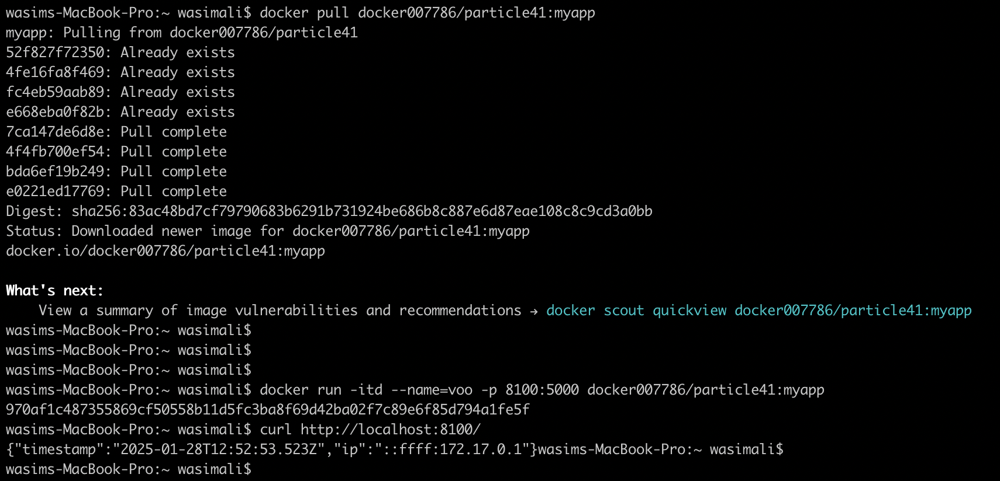
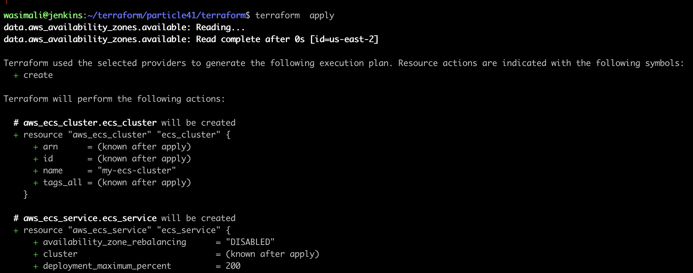
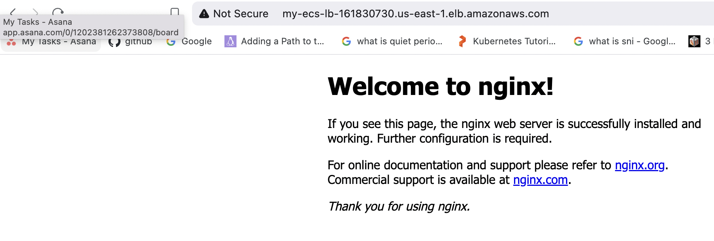

# particle41
**====================== Task 1 Minimalist Application Developmen.==============================** 
Tiny App Development: 'SimpleTimeService'

###### Running the App from an Existing Image
# 1. Pull the Docker Image
docker pull docker007786/particle41:myapp

# 2. Run the Docker Container
docker run -itd --name=voo -p 5000:5000 docker007786/particle41:myapp

# 3. Access the App
curl http://localhost:5000 
Note: check ports 

**=========== Task 2 Terraform and Cloud: create the infrastructure to host your container.===================** 

### Prerequisites 
Before running the Terraform scripts, you need to set up your AWS Access and Secret Access Keys. Follow the steps below: 

Go to the AWS Management Console. 
Click on your profile name (located at the top-right corner). ---->  Select "My Security Credentials." ----> Navigate to the Access Keys section. ---> Click on "Create New Access Key" to generate a set of keys. 

Use these keys to authenticate Terraform with AWS by setting them in your environment variables or a credentials file 

# 1. Clone the repository and navigate to the Terraform directory:
git clone git@github.com:wasimalii/particle41.git 
cd particle41/terraform

# 2. Terraform commands to plan and apply the configuration:
terraform plan 
terraform apply

# 3.Expected Output: 

Accessing the Application Load Balancer (ALB) DNS will show an Nginx default page.

The following resources will be created: 
A VPC with 2 public subnets and 2 private subnets. 
An ECS cluster deployed in the private subnets of the VPC. 
An ECS Task running nginx container. 
A Load Balancer (ALB) in the public subnets to route traffic to the private subnets where tasks are running.

